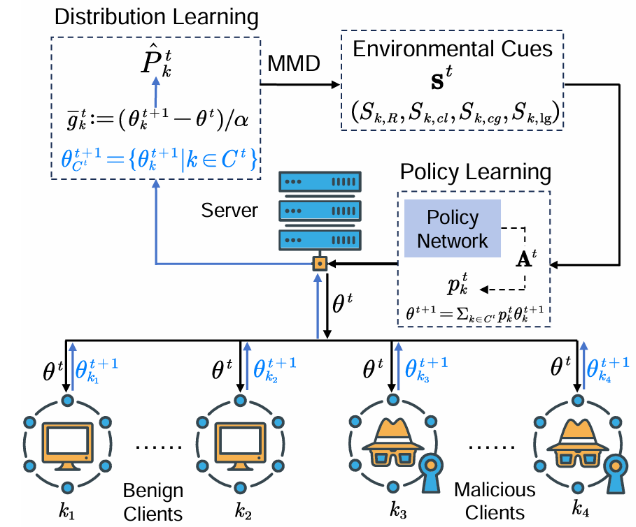

基于强化学习的自适应聚合方法
======================================================

1. 项目背景
----------------------------

联邦学习（FL）是一种很有前途的机器学习方法，模型训练分布在多个本地设备上，而不是集中在单个服务器上。它既能保证用户隐私数据的安全性，又能通过协同不同本地数据源的数据提高模型性能。它在各种场景中都有应用，包括智慧医疗、金融服务、物联网和智能交通。然而，FL系统是脆弱的，聚合模型的性能很容易受到来自未知客户端的模型投毒攻击，特别是针对中央服务器定制的复杂投毒策略。

传统的防御方法主要依靠设计局部模型更新评估机制或使用鲁棒聚合方法来减轻投毒攻击的影响。当前针对联邦学习投毒攻击的防御策略可分为两类：

1. **设计局部模型更新评估机制**：以识别恶意客户端提交的模型参数。
2. **基于数理统计设计新的拜占庭容错聚合算法**：以提高聚合的鲁棒性。

在评价机制方面：

- **Blanchard等人**采用平方距离度量局部更新之间的距离，并选择具有最小距离的局部更新作为全局模型参数。
- **Sattler等人**根据客户提交的模型参数之间的余弦相似性将更新划分为不同的组，以减轻中毒攻击的影响。

为了应对更隐蔽的中毒攻击，一些评估方法要求服务器收集一部分干净的数据，作为验证模型更新的基础。在鲁棒聚合算法中，统计方法比较来自客户端的局部模型更新，并在使用它们更新全局模型之前删除统计异常值。

2. 模型架构
----------------------------

基于强化学习的自适应聚合方法 **AdaAggRL**，以防御复杂的投毒攻击。通过比较客户端数据分布的稳定性来确定局部模型的聚合权重：

2.1 阶段 1：分布学习
~~~~~~~~~~~~~~~~~~~~~~~~~~~~~~~~~~~~~~~~~~

包含两个核心任务：

- 根据上传的模型参数来模拟客户端数据分布

2.2 阶段 2：环境指标的计算
~~~~~~~~~~~~~~~~~~~~~~~~~~~~~~~~~~~~~~~~~~

利用最大均值差异（Maximum Mean Discrepancy, MMD）计算当前局部模型数据分布、其历史数据分布和全局模型数据分布的两两相似度，以评估客户端数据分布的稳定性；考虑到分布学习的精度可能会影响上述相似度的计算，提出使用重构相似度作为分布学习质量的评价指标。

2.3 阶段 3：策略梯度学习
~~~~~~~~~~~~~~~~~~~~~~~~~~~~~~~~~~~~~~~~~~

基于上述三种分布相似度和分布学习的重构相似度，使用策略学习方法 **TD3** 自适应确定聚合权重。

3. 接口设计
----------------------------

3.1 通用接口设计
~~~~~~~~~~~~~~~~~~~~~~~~~~~~~~~~~~~~~~~~~~

**创建并初始化环境接口**

.. code-block:: python

    def create_fl_mnist_environment(args) -> gym.Env:
        """
        创建并初始化一个 FL_mnist 环境对象，用于强化学习训练。
        
        参数:
        - args (Namespace): 包含训练配置参数的命名空间对象，如客户端数量、子采样率、数据集等。
        
        返回:
        - env (FL_mnist): 已初始化的 FL_mnist 环境对象。
        """
        env = FL_mnist(args)
        return env

**模型创建接口**

.. code-block:: python

    def create_td3_model(env: gym.Env, action_noise: ActionNoise, checkpoint_path: str) -> TD3:
        """
        创建并初始化 TD3 强化学习模型。
        
        参数:
        - env (gym.Env): 初始化的强化学习环境对象。
        - action_noise (ActionNoise): 为动作选择提供噪声。
        - checkpoint_path (str): 用于保存模型检查点的路径。
        
        返回:
        - model (TD3): 已初始化的 TD3 强化学习模型。
        """
        checkpoint_callback = CheckpointCallback(save_freq=1000, save_path=checkpoint_path, name_prefix='rl_model')
        
        model = TD3(
            "MlpPolicy", 
            env, 
            buffer_size=1000,
            policy_kwargs={"net_arch" : [256, 128]},
            tensorboard_log=checkpoint_path,
            verbose=1, 
            gamma=0.99, 
            action_noise=action_noise, 
            learning_rate=1e-5, 
            train_freq=(3, 'step'), 
            batch_size=64
        )
        
        return model

3.2 强化训练接口
~~~~~~~~~~~~~~~~~~~~~~~~~~~~~~~~~~~~~~~~~~

**训练模型接口**

.. code-block:: python

    def train_model(model: TD3, total_timesteps: int, checkpoint_callback: Callback) -> None:
        """
        训练强化学习模型，使用指定的回调和时间步数。
        
        参数:
        - model (TD3): 强化学习模型。
        - total_timesteps (int): 训练的总时间步数。
        - checkpoint_callback (Callback): 用于训练过程中的模型检查点回调。
        
        返回:
        - None
        """
        print('start training.......')
        model.learn(total_timesteps=total_timesteps, log_interval=1, callback=checkpoint_callback)

**步骤接口**

.. code-block:: python

    def step_environment(env: gym.Env, action: np.ndarray) -> Tuple[np.ndarray, float, bool, dict]:
        """
        执行环境中的一步操作，传入动作并获取相应的反馈。
        
        参数:
        - env (gym.Env): 强化学习环境对象。
        - action (np.ndarray): 当前时间步的动作。
        
        返回:
        - new_state (np.ndarray): 环境的新状态。
        - reward (float): 执行动作后的奖励。
        - done (bool): 是否达到结束状态。
        - info (dict): 额外信息，如损失值和准确率。
        """
        new_state, reward, done, info = env.step(action)
        return new_state, reward, done, info

**重置环境接口**

.. code-block:: python

    def reset_environment(env: gym.Env) -> np.ndarray:
        """
        重置环境，初始化新的状态以开始新的训练轮次。
        
        参数:
        - env (gym.Env): 强化学习环境对象。
        
        返回:
        - initial_state (np.ndarray): 重置后的环境初始状态。
        """
        initial_state = env.reset()
        return initial_state

3.3 客户端训练接口
~~~~~~~~~~~~~~~~~~~~~~~~~~~~~~~~~~~~~~~~~~

.. code-block:: python

    def train_client(net: nn.Module, trainloader: DataLoader, lr: float, steps: int) -> Tuple[float, float]:
        """
        在指定的客户端数据加载器上训练网络模型，返回新的损失和准确率。
        
        参数:
        - net (nn.Module): 需要训练的神经网络模型。
        - trainloader (DataLoader): 训练数据加载器。
        - lr (float): 学习率。
        - steps (int): 训练步骤。
        
        返回:
        - new_loss (float): 训练后的损失值。
        - new_acc (float): 训练后的准确率。
        """
        num_pic, labels, steps = train_real(net, trainloader, epochs=1, lr=lr)
        new_weight = get_parameters(net)
        new_loss, new_acc = test(net, trainloader)
        return new_loss, new_acc

4. 数据准备
----------------------------

AdaAggRL使用以下数据集支持训练与评估：

1. **MNIST数据集**：数据集是机器学习领域中最经典的图像数据集之一，广泛用于手写数字识别任务。
2. **CIFAR10数据集**：一组常用于图像分类任务的 32x32 像素彩色图像。它包含 10 个不同的类别，广泛用于计算机视觉领域的研究和基准测试。
3. **EMNIST数据集**：对 MNIST 数据集的扩展，包含了更多的手写字母和数字。EMNIST 数据集旨在为字母和数字识别任务提供更多样化的样本，常用于字母识别、自然语言处理中的字符识别等任务。
