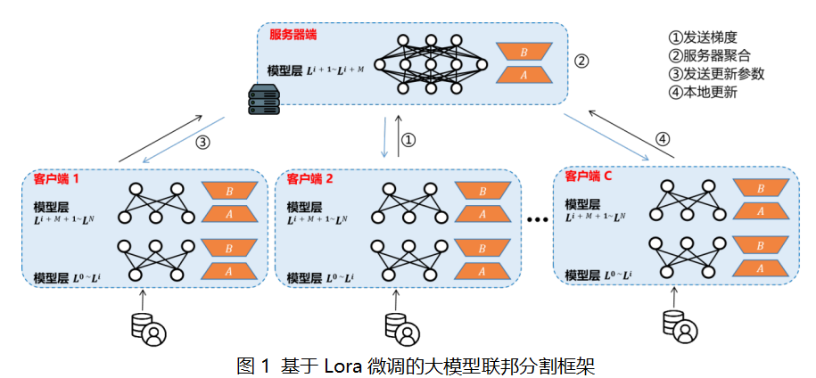
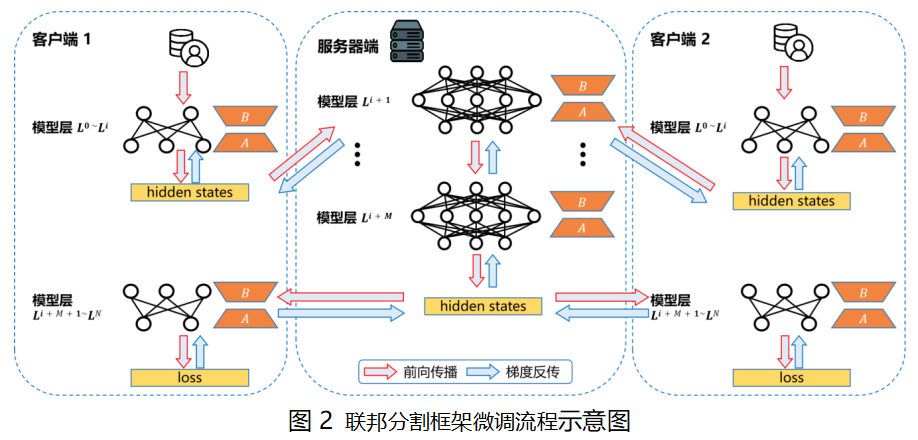

基于 Lora 微调的大模型联邦分割框架
====================================================================

1. 项目背景
--------------

2022 年 ChatGPT 的问世正式标志着大模型时代的到来。ChatGPT 流畅地回答各种类型的问题，阐述各领域的知识，给人留下深刻印象。研究人员发现，模型参数量和数据量的大规模堆叠会引发模型“智能”的突然涌现。据 Meta 官方介绍，Meta 开源的 LLaMA3 系列大模型参数量最高达 700 亿，训练时使用了约 15 万亿的 Token。

目前，大模型训练的数据多来源于企业从互联网爬取的数据或企业内部已有的用户数据，其中包含大量用户私人敏感信息。如何在训练大模型时保护用户数据隐私，实现数据可用不可见，是亟待解决的问题。在这种背景下，联邦学习作为解决数据隐私问题的一种有效手段，逐渐受到关注。联邦学习允许数据持有者在不直接共享原始数据的情况下共同训练模型。通过分散模型训练过程，能够在保护用户隐私的同时，有效利用各方数据资源。

然而，联邦学习的一个要求是所有客户端在本地都需要维护一个全量参数的模型。随着模型参数量的不断增加，训练大规模深度学习模型所需的计算资源也显著增长。例如，LLaMA3 模型的训练是在两个各配备 24,000 张 GPU 的集群上完成的。这种庞大的算力需求带来了极高的训练成本，使得中小企业难以承受。

大规模语言模型的训练语料库覆盖社交论坛、新闻报道、文学作品及编程代码等多种异构信息源。尽管通过大规模语料库的预训练，这些模型具备了基础能力，但它们仍缺乏执行特定任务（如与用户的自然对话交互、文本摘要生成等）的专有能力。为此，通常需要针对具体应用场景的数据集进行额外的指令微调，以增强模型的功能性和实用性。

考虑到大规模模型训练所需的巨大计算资源，Lora 微调技术以其经济性和高效性，成为企业青睐的重要微调方法。据 Lora 团队介绍，在 GPT-3 训练过程中，当设置 lora 秩为 4 时，相比于全参数微调，Lora 微调的显存消耗从 1.2TB 降至 350GB，减少幅度达 2/3。然而，即便如此，在低计算资源场景下，例如消费级显卡、小微企业服务器、医院、政府数据中心等，资源消耗仍然显著。

针对用户隐私数据保护与低资源消耗场景，本发明利用分割学习技术，提出基于 Lora 微调的大模型联邦分割框架。分割学习通过将神经网络的不同层或部分划分到多个计算节点上，解决单一计算节点的内存和计算能力瓶颈问题。通过将大规模神经网络分布到多个设备（如 GPU 或 TPU）上，不同设备分别处理模型的不同部分，从而突破单一设备处理能力的限制，使得即便是超大规模模型也能被高效训练和推理。

2. 模型架构
--------------

FedLlama 的架构结合了联邦学习的数据隐私保护特性和分割学习的计算资源优化特性。其主要功能包括：

- **分布式训练**
- **多客户端批训练**
- **分布式推理**

2.1 分布式训练
~~~~~~~~~~~~~~~~~~

在 FedLlama 微调训练过程中，客户端前 `i+1` 层经过前向传播生成隐藏状态（hidden states）。这些隐藏状态传递到服务器端，由服务器端的中间 `M` 层模型继续处理，生成输出。服务器端输出向量传回客户端，客户端完成剩余层的前向传播，计算出损失（loss），并按原路径进行梯度反传。

2.2 多客户端批训练
~~~~~~~~~~~~~~~~~~~~~

以两个客户端为例，FedLlama 的分布式训练如图所示。训练结束后，服务器端与各客户端均拥有自身模型的 Lora 适配器。

2.3 分布式推理
~~~~~~~~~~~~~~~~~~

推理时，服务器端和客户端只需加载初始大模型与 Lora 适配器即可完成任务。由于大模型以自回归方式生成回答，生成下一个 Token 需用到用户的 Query 和先前生成的所有 Token。因此，推理流程为：用户的 Query 经客户端-服务端-客户端生成一个 Token 后，与原 Query 拼接为新 Query，继续前向传播，直至生成结束符号。

3. 接口设计
--------------

3.1 通用接口设计
~~~~~~~~~~~~~~~~~~~~~~

**服务器端初始化接口**

.. code-block:: python

    class FLserver(server):
        """Flower 服务器用于分层联邦学习"""
        def __init__(self, optimizer, schedule, ServerModel, args, logger, client_manager, strategy=None, child_conn_server=None):
            """初始化 FL Server 实例"""
            super().__init__(client_manager=client_manager, strategy=strategy)

**客户端初始化接口**

.. code-block:: python

    class Fed_Client(NumPyClient):
        """处理 LLaMA 模型训练和评估的联邦学习客户端"""
        def __init__(self, datalist, optimizer, schedule, models, tokenizer, FL_args, child_conn):
            """初始化客户端实例"""
            super(Fed_Client, self).__init__()

3.2 分布式训练接口
~~~~~~~~~~~~~~~~~~~~~~

**服务器端训练接口**

.. code-block:: python

    def train(self, client_instructions, num_rounds, timeout, start_time, history):
        """执行联邦学习的训练过程"""

**客户端训练接口**

.. code-block:: python

    def train_fit_partA(self, parameters=None, current_step=0, need_test_data=0):
        """客户端模型 A 的前向传播"""

3.3 分布式批训练接口
~~~~~~~~~~~~~~~~~~~~~~~

**服务器端批训练接口**

.. code-block:: python

    def BatchParallel_train(self, client_instructions, num_rounds, timeout, start_time, histories):
        """执行批量并行训练过程"""

3.4 分布式推理接口
~~~~~~~~~~~~~~~~~~~~~

**服务器端推理接口**

.. code-block:: python

    def predict(self, client_instructions, num_rounds, timeout, start_time, history):
        """执行预测过程"""

**客户端推理接口**

.. code-block:: python

    def predict_fit_partA(self, parameters=None, current_step=0, need_test_data=0):
        """客户端模型 A 的前向传播以进行预测"""

3.5 网页展示接口
~~~~~~~~~~~~~~~~~~~

.. code-block:: python

    def main():
        """初始化 Streamlit 页面配置，显示聊天历史"""

4. 数据准备
--------------

FedLlama 支持以下数据集：

- **CoQA 数据集**：对话问答数据集，标注了每轮对话的问题和人类回答。

**数据集处理代码**

.. code-block:: python

    from datasets import load_dataset

    def get_dataset_no_pad(args, tokenizer):
        """加载并预处理数据集，不进行填充"""

5. 案例分析
--------------

5.1 分布式训练大模型
~~~~~~~~~~~~~~~~~~~~~~~~~

**训练脚本**

.. code-block:: bash

    nohup python /home/zhangzishuai/SplitFederated-LLaMA/flserver_llama6.py \
    --do_train \
    --device $Device \
    --server_ip $ServerIP \
    --lora_r $Lora_r \
    --lora_alpha $Lora_alpha \
    --seed $Seed \
    --lr $LearningRate \
    --torch_dtype $Torch_dtype \
    --weight_decay $Weight_decay \
    --save_step $SAVE_STEP \
    --max_step $MAX_STEP \
    --output_dir "$OUTPUT_DIR" > "$LOG_FILE_1" 2>&1 &

**训练输出 Lora Adapter**

version_1_r8_alpha16_Ir0.00005_seed42/model-A
>checkpoint-1000
>checkpoint-2000
>checkpoint-3000
>checkpoint-4000
>checkpoint-5000
>checkpoint-6000
>checkpoint-7000
>checkpoint-8000
>checkpoint-9000