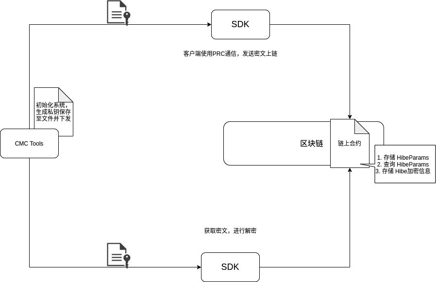

区块链身份分层加密技术方案
============================

需求
~~~~

需求概述
^^^^^^^^^^
区块链技术由于可以在无需第三方的情况下实现所有数据的公开透明、不可篡改、不可伪造等特性，在诸如数字政务、数字货币、金融资产交易结算等领域具有广阔的应用场景。很多区块链应用场景中，都会存在数据按层级划分可见性的需求，也就是说，允许上层的用户/节点查看下层用户/节点的数据，但是处于下层的用户/节点无法查看上层用户/节点的数据，并且同一层级的用户/节点间的数据不可见。

具体场景
^^^^^^^^^^
1.税务场景，税务总局可以查看所有省市相关数据，各省之间数据不互通，跨省的交易数据在相关方可见。

2.大型企业场景，集团对所有数据可见，二级公司之间数据互不可见，二级公司可查看下辖的三级公司数据，以此类推。

身份分层加密
~~~~~~~~~~~~~~~~~

身份分层加密概述
^^^^^^^^^^^^^^^^^^

身份分层加密（ Hierarchical Identity Based Encryption, HIBE ）是对属性加密（ Identity Based Encryption, IBE ）的一种改进方案，它是一种由层级结构定义的属性加密。在传统的属性加密中，节点/用户之间没有层级结构关系，节点/用户的身份信息（属性）作为公钥，由密钥生成中心（ Private Key Generator , PKG ）为每个节点/用户生成解密密钥并进行分配。HIBE 打破了传统的 IBE 方案，构造了一种层级结构关系，每一层节点/用户用来进行数据解密的解密密钥都由上一层级进行分配，也就是说，只有根节点/用户的密钥由 PKG 进行分配，这使得密钥的分配过程不再复杂，使得计算、权限分派变得简单，通信开销减少，适用于许多权限分级应用中。

身份分层加密整体架构
^^^^^^^^^^^^^^^^^^^^

.. _整体架构:

身份分层加密方案描述
^^^^^^^^^^^^^^^^^^^^

.. image:: ../images/HIBE-flow.png
.. _方案描述:

接口介绍
~~~~~~~~~~~~~~~~~

**1.创建生成身份分层参数初始化交易 payload**

.. code-block:: 

    CreateHibeInitParamsTransactionPayloadParams(orgId string, hibeParamsFilePath string) (map[string]string, error)

**2. 生成身份分层加密交易 payload params，加密参数已知**

.. code-block:: 

    CreateHibeTxPayloadParamsWithHibeParams(plaintext []byte, receiverIds []string, paramsBytesList [][]byte, txId string, keyType crypto.KeyType) (map[string]string, error)

**3. 生成身份分层加密交易 payload params，hibe.Params根据 receiverOrgIds 链上查询得出**

.. code-block:: 

    CreateHibeTxPayloadParamsWithoutHibeParams(contractName, queryParamsMethod string, plaintext []byte, receiverIds []string, receiverOrgIds []string, txId string, keyType crypto.KeyType, timeout int64) (map[string]string, error)

**4. 查询某一组织的加密公共参数**

.. code-block:: 

    QueryHibeParamsWithOrgId(contractName, method, orgId string, timeout int64) ([]byte, error)

**5. 已知交易id，私钥，解密链上hibe交易密文信息**

.. code-block:: 

    DecryptHibeTxByTxId(localId string, hibeParams []byte, hibePrvKey []byte, txId string, keyType crypto.KeyType) ([]byte, error)