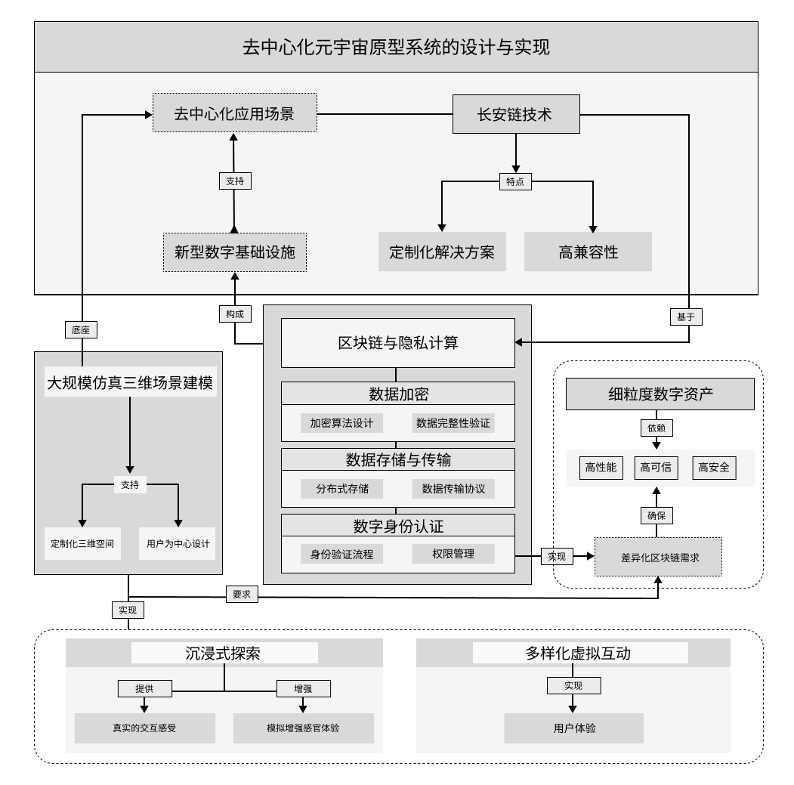
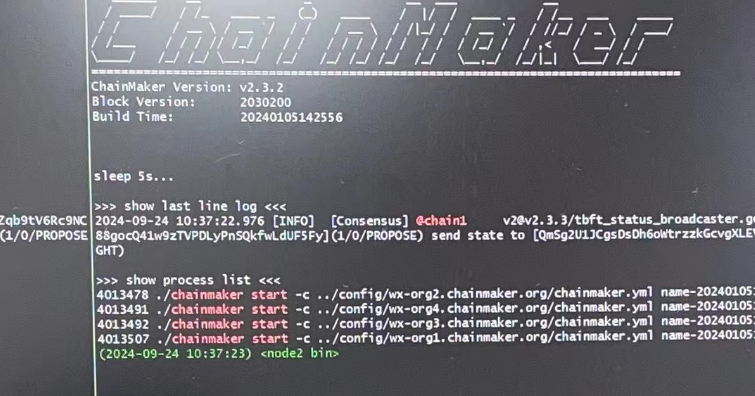

MetaVerse: 去中心化元宇宙原型系统
=============================

1. 项目背景
-------

随着虚拟现实（VR）、增强现实（AR）和区块链技术的不断发展，元宇宙的概念逐渐成为一个重要的技术趋势。元宇宙作为一个高度沉浸的虚拟世界，能够为用户提供跨平台、跨设备的虚拟互动体验。然而，目前的元宇宙应用存在许多问题，制约了其发展和普及。

- **现有虚拟环境的局限性**: 首先，现有的虚拟环境主要基于头戴式显示设备，提供单一环境的沉浸式体验。这种体验通常局限于个人用户，难以实现多人互动和社交功能，且用户的虚拟世界体验无法在不同设备和平台之间无缝连接。此外，传统的虚拟现实技术还未能有效解决跨平台互通的问题，这使得不同设备上的用户无法共享同一个虚拟环境。

- **区块链技术的可扩展性挑战**: 其次，尽管区块链作为去中心化技术在许多领域取得了重要进展，但在元宇宙的应用中，区块链的可扩展性仍然是一个重大挑战。现有的区块链技术在处理大规模数据和交易时面临效率瓶颈，无法支持元宇宙中复杂的数据传输和存储需求。与此同时，区块链的隐私和安全性问题也亟待解决，尤其是在用户数据和虚拟资产的管理方面。

- **中心化信息传递机制的缺陷**: 最后，现有的中心化信息传递机制通常依赖于单一平台，这不仅容易导致信息的不公平流通和数据泄露，还使得平台的运营者可能滥用权力，限制了元宇宙的可扩展性和开放性。

为了解决上述问题，我们提出了一种创新的去中心化元宇宙原型系统。该系统基于长安链等区块链技术，实现了去中心化的数据存储和传输，保障用户隐私和虚拟资产的安全。同时，我们还提出了一种多终端自适应渲染技术，实现了跨平台互通和无缝连接，极大提高了虚拟世界的沉浸感和互动性。
通过去中心化的架构设计，我们能够消除中心化平台带来的数据安全隐患和信息不公平流通问题，为用户提供更加开放、公平和安全的元宇宙体验。

2. 项目架构
-------

本项目的核心架构包括以下几个部分：

1. **去中心化平台**：通过长安链保障元宇宙的去中心化，避免单一平台的控制。
2. **虚拟现实环境**：提供多类型的实时交互和跨平台自适应渲染，构建大规模的三维场景。
3. **数字资产管理**：通过区块链技术实现细粒度的元宇宙数字资产管理，确保虚拟资产的真实性和可追溯性。(待实现)

3. 链上操作
------------

在本项目中，区块链主要发挥以下几个作用：

- **去中心化数据传输和存储**：所有元宇宙中的数据都通过区块链进行传输和存储，确保数据的安全性和不可篡改性。
- **去中心化身份认证和社交互动**：区块链支持去中心化身份管理系统，确保用户在元宇宙中的隐私安全，同时提供跨平台的社交互动体验。
- **数字资产管理**：通过智能合约和区块链技术，构建细粒度的元宇宙数字资产模型，包括虚拟物品、土地、角色等的所有权、交易和溯源。(待实现)

3.1 启动长安链
~~~~~~~~~~~~~~~~
.. code-block:: bash
    $ cd chainmaker-deploy/chainmaker/scripts
    $ sudo bash ./cluster_quick_start.sh

3.2 安装合约
~~~~~~~~~~~~~~~~

.. code-block:: bash
    # 示例代码：导入元宇宙合约
    $ sudo ./cmc client contract user create \
    --contract-name=meta_verse \
    --runtime-type=DOCKER_GO \
    --byte-code-path=./meta_verse.7z \
    --version=1.0 \
    --sdk-conf-path=./sdk_config.yml \
    --admin-key-file-paths=./crypto-config/wx-org1.chainmaker.org/user/admin1/admin1.tls.key \
    --admin-crt-file-paths=./crypto-config/wx-org1.chainmaker.org/user/admin1/admin1.tls.crt \
    --sync-result=true \
    --params="{}"

3.3 验证
~~~~~~~~~~~~~~~~

.. code-block:: bash
    # 示例代码：验证元宇宙合约安装成功
    $ sudo ./cmc client contract user get \
    --contract-name=meta_verse \
    --method=user_get \
    --sdk-conf-path=./sdk_config.yml \
    --params="{\"account\":\"abc123\"}"

3.4 长安链启动效果
~~~~~~~~~~~~~~~~

4. 后端用户加密接口
-------

4.1. 加密用户注册
~~~~~~~~~~~~~~~~
.. code-block:: go
func (s *UserService) Register(c *gin.Context, params *request.RegisterReq) error {
	user, err := s.getUserInfo(c, params.Account)
	if err != nil {
		log.Error(c, err.Error())
		return err
	}

	if user.Account == params.Account {
		return errors.New("账号已存在，不能重复注册")
	}

	password := common.EncryptPassword(params.Password)
	identity, err := crypto.SM4Encrypt([]byte(common.IdentityKey), []byte(params.Identity))
	if err != nil {
		return err
	}

	m := make(map[string][]byte)
	m["account"] = []byte(params.Account)
	m["name"] = []byte(params.Name)
	m["password"] = []byte(password)
	m["mobile"] = []byte(params.Mobile)
	m["email"] = []byte(params.Email)
	m["identity"] = identity
	m["gender"] = []byte(strconv.Itoa(params.Gender))
	err = chainmaker.InvokeContract(ContractName, "user_register", util.UUID(), m)
	if err != nil {
		log.Error(c, "InvokeContract error. "+err.Error())
		return err
	}

	return nil

}

4.2. 加密用户登录
~~~~~~~~~~~~~~~~

.. code-block:: go
func (s *UserService) Login(c *gin.Context, params *request.LoginReq) (interface{}, error) {
	user, err := s.getUserInfo(c, params.Account)
	if err != nil {
		log.Error(c, err.Error())
		return nil, err
	}

	if len(user.Account) == 0 {
		return nil, errors.New("账号不存在")
	}

	password := common.EncryptPassword(params.Password)
	if password != user.Password {
		return nil, errors.New("密码错误")
	}

	if len(user.Identity) > 0 {
		identity, err := crypto.SM4Decrypt([]byte(common.IdentityKey), []byte(user.Identity))
		if err != nil {
			return nil, err
		}

		user.Identity = string(identity)
	}

	return user, nil
}

5. 效果展示
-------

本项目已完成初步原型的设计，并进行了多终端的测试。以下是项目的一些效果展示。

- **沉浸式虚拟现实环境**：提供多样化的场景和互动体验，支持VR头显、PC和移动端的跨平台访问。
- **去中心化交互演示**：用户可以在去中心化平台上进行实时互动，拥有完全的资产所有权和控制权。

.. image:: ../images/meta/final.gif
   :alt: 效果展示图

6. 结论
-------

通过长安链和区块链技术的结合，本项目成功构建了一个去中心化的元宇宙原型系统。该系统提供了更加开放、安全和公平的虚拟世界，支持多平台接入、实时互动和虚拟资产的管理，具有较强的扩展性和创新性。未来，我们将继续优化系统的性能，实现数字资产管理，扩展更多应用场景，并推动元宇宙向更加多元化、去中心化的方向发展。
