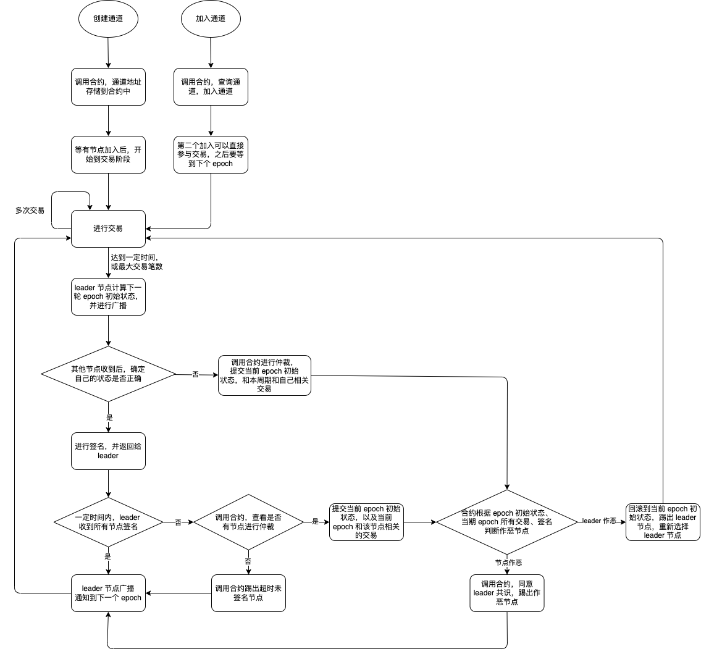
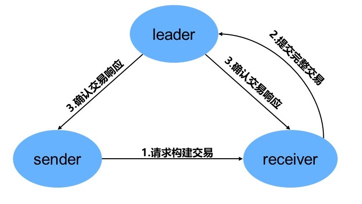

区块链链下扩容技术方案
================================

概述
~~~~

链下扩容也常被称为 Layer-2扩容方案，链下扩容和链上扩容是相对的，链下扩容换了种思路，链下通道的原理是把“记账”过程迁移到链下进行，用户彼此之间可以在链下进行数百次业务（交易），最后通过向链上提交链下通道的最终（或阶段性）的状态。在此过程只有加入和结束的信息上链，减轻区块链的共识压力。链下的交易不进行全网广播，因此相比链上交易具有更高的隐私性。

主要流程
~~~~~~~~

链下扩容主要由链下交易、链下共识以及链上通道合约组成，领导者节点组织链下的交易和共识过程，当领导者的更新提议得到全部用户的投票后，把链下检查点提交到链上通道智能合约，下图描述了链下通道的主要流程。

.. image:: ../images/main_flow.png

.. _主要流程-1:

主要流程：
^^^^^^^^^^

-  A1).交易发起人用户1向用户3发起转账请求。

-  A2).交易收款人用户3对这笔交易的签名表示同意交易，并返回给用户1

-  A3).交易发起者用户1向领导者提交附有双方签名的交易

-  A4).领导者对该笔交易的合法性检查无误后回复交易回执。

经过一个轮次（多笔交易）的链下交易后进入链下共识阶段：

-  B1).领导者发布检查点更新提案

-  B2).其他用户收到提案后，回复对该提案的签名表示对该提案的投票。

-  B3).领导者获得全部用户的投票后把提交检查点到链上通道合约，或超时未收集齐，则领导者节点调用合约查看是否有挑战者

-  B4).当链下出现共识争议，挑战者节点提交当前轮次涉及自己的所有交易构造的默克尔树，领导者节点提交当前轮次涉及挑战者节点的所有交易构造的默克尔树，交由链上合约解决争议。

如图：

链下交易过程
~~~~~~~~~~~~

链下交易模块实现了区块链链下通道内交易的功能，链下交易与链上交易解耦，链下交易结构定义区别于链上交易结构，只将链下阶段性的用户状态通过链上交易存入区块链。链下交易具体流程如下：

   节点

1. 用户向交易接收方请求构建交易。链下交易发送方随机生成一个唯一的uuid对交易进行构造，设置交易的发送方、接收方、支付金额和其他状态参数，并对交易进行签名，最后向接收方发送此交易，请求其对交易进行签名。

2. 接收方响应构建交易请求。接收方接收到发送方构建交易的请求后，验证发送方交易签名，若验证通过，则使用其私钥对交易签名，并将具有交易双方签名的交易发送给leader。

3. leader向交易双方响应确认交易。当前leader收到带有双方签名的交易，验证交易双方签名，若验证通过，leader将使用其私钥对交易进行签名，签名后向交易双方响应确认信息。

链下共识过程
~~~~~~~~~~~~

本链下扩容方案为多人链下通道，关键优势在于用户向

.. figure:: ../images/consensus_flow.jpg
   :alt: 链下共识过程

   链下共识过程

1. 当前 epoch 的 leader 节点在交易周期结束时驱动通道进入共识阶段，首先
   leader 节点计算当前 epoch 的最终状态，包括当前epoch、下个周期
   leaderId、所有通道参与者的余额、节点退出集合。leader
   将最终状态在通道中进行广播，并等待接收通道参与者对最终状态的签名。

2. 通道参与者从 leader 节点接收到当前 epoch
   的最终状态，需验证自己的余额是否正确，若验证通过，通道参与者对最终状态进行签名，并将此签名发送给
   leader 节点，等待 leader 节点的状态确认消息。

3. leader
   节点接收到所有通道参与者的签名并验证，若验证签名通过后，将一个包含最终状态和所有通道参与者对状态签名的确认消息广播给所有参与者，以完成当前的epoch。至此，多人通道的参与者即可进入下一个epoch。

链上通道智能合约
~~~~~~~~~~~~~~~~

链上通道合约作为连接链与链下通道的桥梁，它的功能主要是是记录链下通道的交易情况和行为，同时为关键的链上操作提供执行的完整性和正确性保证。部署在链上的通道智能合约能够保证用户挑战时的正确性。

合约判断流程如下：

.. image:: ../images/contract_adjust.png

1. 首先判断双方提交的默克尔树根是否相同，如果相同，则认为领导者正确。这里分情况讨论，第一种情况，挑战者没有作弊，提交了涉及自己的所有交易，那么领导者节点提交的该挑战者的交易和挑战者相同，则认为所有交易都正确，挑战者发起无意义挑战，领导者正确，第二种情况，挑战者作弊，隐瞒部分交易，领导者节点提交的该挑战者的交易和挑战者相同，由于挑战者作弊，则领导者节点正确。

2. 若默克尔树根不同，则判断交易数量相同部分是否相同，若不同，则开始验证交易不同部分及后面所有交易签名，若相同则判断交易数量是否相同，若相同则认为领导者正确，否则也开始验证交易不同部分及后面所有交易签名。

3. 若挑战者提交交易签名有问题，则领导者正确，否则判断领导者提交交易，若领导者提交交易签名有问题，则挑战者正确，都正确则判断交易数量

4. 若挑战者提交的交易数量多，则挑战者正确，否则领导者正确

5. 领导者正确，则领导者提交该阶段状态到链上同到合约，若挑战者正确，则回滚该阶段状态。选择新的领导者重新开始本阶段交易。
