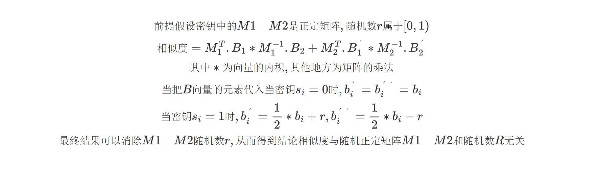
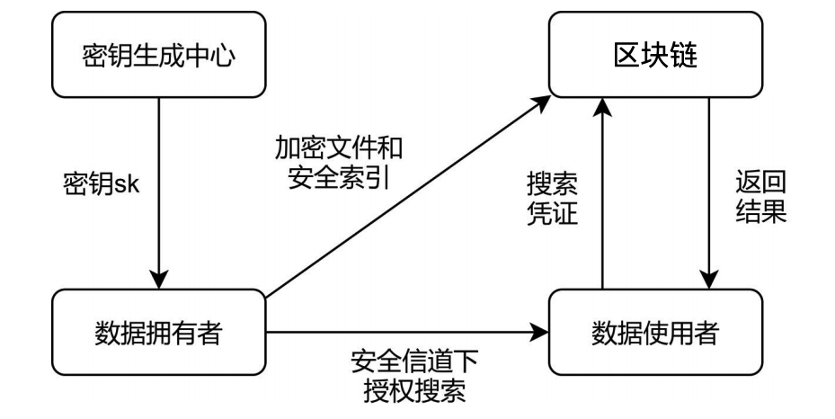

区块链密文检索技术方案
============================

概述
~~~~
随着区块链的迅速发展以及用户对个人数据隐私性的愈加重视，如何对存储在区块链中的密文进行搜索就显得格外重要．可搜索加密方法（searchable encryption，SE）是解决密文搜索的有效方法。对区块链引入可搜索加密技术(Searchable Encryption, SE)对上链数据加密，保护链上数据隐私的同时支持用户对链上密态数据进行搜索，提高了区块链的可用性以及适配更丰富的应用场景的可能性。

为了保护用户的数据隐私，在上链之前需要对数据进行加密。但是加密之后的数据失去了明文特征，使得用户无法高效地进行检索。可搜索加密实现数据安全的同时支持对加密数据的搜索，保证了数据的安全性和可用性，作为解决上述问题的有效方法得到了迅速的发展。针对区块链目前隐私保护存在的问题与挑战，设计基于可搜索加密的区块链隐私保护机制，在不降低账本数据隐私保护强度的前提下，面向多用户和多关键词搜索场景支持对链上密态数据可检索操作，提高了区块链的可用性和适配性;

具体针对场景:
^^^^^^^^^^^^^^

支持多用户: 针对区块链丰富的应用场景,提供了密文检索SDK,支持灵活的适配各种应用场景;

支持多关键字：围绕区块链可搜索加密方案隐私保护机制设计并研发支持多关键字的灵活密态数据搜索方案，为丰富区块链可搜索加密方案的表达能力。

密文检索方案
~~~~~~~~~~~~~~

可搜索加密技术是搜索技术和加密技术的结合。可搜索加密能够实现将用户的数据进行特殊的加密后上传到云服务器或者区块链上, 并且可以实现根据关键字进行检索的功能, 有些可搜索加密方案更能实现范围查询或布尔查询等高级检索功能。在方便用户使用的过程中, 也保护了文件的隐私安全。

密文检索分类
^^^^^^^^^^^^^^^
现今众多的可搜索加密机制技术一般分为对称可搜索加密(SearchableSymmetric Encryption, SSE)和非对称可搜索加密(Asymmetric SearchableEncryption, ASE),非对称可搜索加密目前一般又称为公钥可搜索加密(Public Key Encryption With Searching, PEKS)。两者有不同的应用场景和构造方式。对称可搜索加密一般考虑单用户使用的情况, 相当于建立个人加密云盘, 依赖对称加密算法进行方案构造。公钥可搜索加密一般考虑多用户使用的场景例如邮件系统或者多人文件共享系统, 主要依赖公钥加密算法进行构造。

数学原理
^^^^^^^^^^^^^^^

整体架构
^^^^^^^^^^^^^^^

1.密钥生成中心（CA）：负责生成系统参数和相应密钥。

2.数据所有者（DO）：DO 首先使用对称加密算法对原始文件进行加密，然后生成其对应的加密关键字索引。最后，它将加密文件和相应的关键字索引存储到长安链上。

3.数据用户（DU）：DU 经过严格的授权验证后，在安全信道中获得 DO 的私钥（秘钥协商）。DU 通过多个搜索关键字生成陷门 Token，然后将陷门 Token 发送给长安链进行搜索。

4.区块链（BC）：为 DO 提供文件存储服务，为 DU 提供搜索服务。并且支持数据更新服务。

接口介绍
~~~~~~~~~~~~~~~~~

**1.密钥生成**

生成密钥 索引构建和陷门构建都需要用这个密钥

.. code-block:: 

    GenCipher(scope SEARCHSCOPE) *Cipher

反序列化接口生成密钥的接口 返回结构体每个参数比较大所以没有提供整体序列化的接口,建议每个元素单独序列化后利用下面的接口组合成密钥

.. code-block:: 

    InitCipher(baseUnit int, r float64, m1, m2, sk *mat.Dense, scope SEARCHSCOPE) *Cipher

**2.索引生成**

利用第一步的密钥和需要被搜索的关键词构建索引, 输出是索引

.. code-block:: 

    BuildIndex(keys []string, cipher *keygen.Cipher) []*mat.VecDense

**3.陷门生成**

利用第一步的密钥和需要搜索的关键词构建陷门,输出是陷门

.. code-block:: 

    GenTrapdoor(query []string, cipher *keygen.Cipher) []*mat.VecDense

**4.搜索**

利用索引和陷门搜索出文件的得分

.. code-block:: 

    Search(indexs []*IndexAndID, trap Index) (results Results) 

应用示例
~~~~~~~~~~~~~~~~~
1.整体流程
^^^^^^^^^^^^^^^
1.用户身份认证:注册用户的信息,校验用户身份;

2.用户登录:登录后获取临时token;

3.文件拥有者上传加密文件并根据关键词构建索引;

4.文件拥有者给文件查询者授予查询权限;

5.文件查询者根据关键词构建陷门,利用陷门查询结果,并下载加密的文件;

6.文件查询者利用密钥解密文件;

2.用户身份认证
^^^^^^^^^^^^^^^
启动密文检索服务之后,用户通过下面的接口注册信息

.. code-block:: 

    curl -H "Content-Type: application/json" -X POST -d '{"userId": "x","userNickName": "x","mobileNumber": "x","userPassword": "x","mailBox": "x","remark": "x","role":"x"}' "http://ip:port/ciphertext/v1/users/add"

3.用户登录
^^^^^^^^^^^^^^^

通过下面的接口获取token,作为临时的身份令牌

.. code-block:: 

    curl -H "Content-Type: application/json" -X POST -d '{"userName":"01","userPassword":"UserPassword"}' "http://127.0.0.1:8090/ciphertext/v1/login"

4.上传文件并构建索引
^^^^^^^^^^^^^^^^^^^^^^^

参数说明

1.filePath:上传文件的路径;

2.token:用户的临时身份令牌;

3.keyWord:构建索引的关键字;

4.encryptionType:原始文件的加密方法,示例中支持国密sm4加密;

5.resourcePath:是文件存储的路径;

.. code-block:: 

    curl -H "Content-Type: application/json" -X POST -d '{"filePath":"./testdata/1.txt","token":"x","encryptionType":"sm4","resourcePath":"x"}' "http://127.0.0.1:8090/ciphertext/v1/file"

5.授予权限
^^^^^^^^^^^
文件拥有者给文件查询者授予查询权限;

参数说明

1.act 是授予的权限,一般为查询(search) ;

2.path是授予那个目录下search的权限,目录对应文件上传对应的目录;

3.userId 是被授权用户的id;

4.token是文件拥有者的token;

.. code-block:: 

    curl -H "Content-Type: application/json" -X POST -d '{"act": "x","path": "x","userId": "x","token": ""}' "http://ip:port/ciphertext/v1/authority"

6.查询
^^^^^^^^^^^
根据关键词查询关联的文档;

.. code-block:: 

    curl -H "Content-Type: application/json" -X POST -d '{"keyWord": "x,x","resourcePath":"x","token": "x","exceptNum": x}' "http://ip:port/ciphertext/v1/file/search"

7.解密
^^^^^^^^^^^
可以通过查询的结果下载到加密的文件,利用解密接口最终可以得到解密后的文件;

参数说明

1.key是解密文件的密钥;

2.filePath是加密文件的目录;

3.token是解密者的token;

.. code-block:: 

    curl -H "Content-Type: application/json" -X POST -d '{"key":"x","filePath":"x","token":"x"}' "http://ip:port/ciphertext/v1/decrypt"